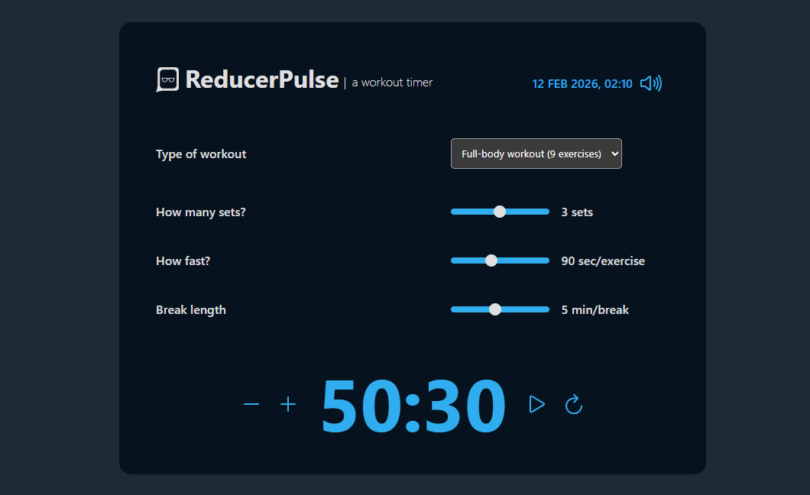

<h1>PulseReducer</h1>

https://pulsereducer.netlify.app/

  A training project demonstrating useReducer, Context API, and useMemo by building a workout interval timer.

## 👍 My Challenges:

- Implementing a workout interval timer with React hooks.
- Managing global state using Context API.
- Optimizing performance with useMemo.
- Responsive design and clean component structure.

## 🎉 Build With:

- React JS
- Semantic HTML5 markup
- CSS Flexbox and Grid
- Mobile-first workflow
- Custom CSS properties
